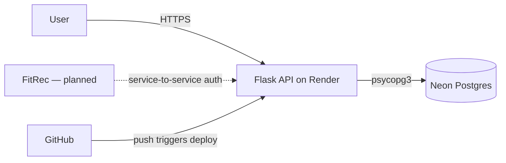

# GymBuddy

A REST API for tracking gym workouts. Built as a learning portfolio project.

**Live API:** https://gymbuddy-3de3.onrender.com
**Interactive docs:** https://gymbuddy-3de3.onrender.com/api/docs/

GymBuddy lets users register, log workouts and individual sets, save reusable workout templates, and view aggregated stats (volume over time, personal records, workout frequency). It's designed as the data backend for a separate recommendation service (FitRec) — a future companion project that consumes GymBuddy's data to generate personalised workout suggestions.

This project is API-first and deliberately backend-only. A unified frontend across GymBuddy and FitRec is planned as a separate piece of work.

## Architecture



The API is a single Flask service deployed on Render. Persistent data lives on Neon Postgres. Schema changes are managed through Flask-Migrate (Alembic); every push to `main` runs `flask db upgrade` against the production database before gunicorn starts. The seed catalogue of exercises is loaded via a custom CLI command that's idempotent across deploys.

## Tech stack

| Type | Choice | Why |
|------|--------|-----|
| Language | Python 3.14 | Mature, batteries-included for backend work |
| Web framework | Flask 3 | Lightweight, the right size for a small REST API; Django would be overkill |
| ORM | SQLAlchemy 2 + Flask-SQLAlchemy | Industry-standard Python ORM; database-portable |
| Auth | PyJWT (not Flask-JWT-Extended) | Working with raw JWTs while learning the mechanics, instead of hiding them behind decorators |
| Migrations | Flask-Migrate (Alembic) | Versioned schema changes, reversible, applied automatically on every deploy |
| Database | SQLite (dev), Postgres (prod) | SQLite for fast local dev, Postgres for production concurrency and durability |
| WSGI server | gunicorn | Standard production server for Python web apps |
| Testing | pytest | Plain functions, fixtures, in-memory SQLite per test for isolation |
| Hosting | Render (web service) + Neon (Postgres) | Two free-tier providers chosen for stability and no auto-expiry on data |
| Docs | flasgger (OpenAPI / Swagger UI) | Interactive API documentation auto-generated from route docstrings |

## Features

- **Auth.** Registration, login with JWT tokens, hashed passwords (Werkzeug), token validation decorator with expiry handling.
- **User profiles.** Lazy-created on first PATCH. Validated for fitness goal, experience level, weight, height, date of birth.
- **Exercise catalogue.** 52 seeded exercises across push / pull / legs / cardio / core. Public read endpoints with category and muscle filters.
- **Workouts.** Full CRUD with pagination, date range filtering, exercise filtering. Sets are nested under workouts and support reps, weight, optional RPE.
- **Templates.** Save reusable workout structures with target sets and reps per exercise. "Start workout from template" creates placeholder sets the user fills in at the gym.
- **Stats.** Three aggregation endpoints — volume over time, personal records per exercise (with tie-breaking by date), workout frequency with gap-filled date ranges.
- **Authorisation.** Every endpoint that touches user-owned data filters by `user_id` at the database query level. Cross-user access returns 404 to prevent ID enumeration.

## Running locally

Requires Python 3.11 or newer.

"""bash
git clone https://github.com/JohnstonAntony/GymBuddy.git
cd GymBuddy
python3 -m venv venv
source venv/bin/activate
pip install -r requirements.txt

# Set up env vars
cp .env.example .env
# Edit .env to set SECRET_KEY and JWT_SECRET_KEY (any string is fine for dev)

# Initialise the database and seed exercises
flask --app run.py db upgrade
flask --app run.py seed-exercises

# Run
python run.py
"""

The API listens on `http://localhost:5001`. Interactive docs are at `http://localhost:5001/api/docs/`.

## Running tests

```bash
pytest -v
```

Around 80 tests covering happy paths, validation, authorisation, and edge cases. Each test gets its own fresh in-memory SQLite database for isolation.

## Architectural decisions

A few choices made during development:

**Authorisation at the database query level, not in Python.** Every endpoint that reads user-owned data filters by `user_id` as the first clause of the query, before anything else. This is a "fail closed" pattern — other users' rows never enter the result set, so there's no downstream code path that could accidentally leak data. The alternative (fetch all rows, filter in Python) is the classic shape of IDOR vulnerabilities.

**404 instead of 403 for ownership mismatches.** When a user requests a resource that exists but belongs to someone else, the API returns 404. This prevents enumeration — clients can't probe which IDs are real, security coverage.

**JSON column for workout templates.** Templates are accessed as a single unit and never queried by their internal entries. Using a JSON column avoids a JOIN per template load and keeps the storage shape aligned with how the data's actually used. Alternatives (a `TemplateExercise` table) would have been more "normalised" but solved a query pattern that doesn't exist for this app.

**Filled date ranges for the frequency endpoint, compact for volume.** Volume returns only days with data because the line chart that consumes it handles gaps natively. Frequency returns every date including zeros because a heatmap renders one square per day — gap-filling on the server keeps the client trivial.

**Migrations applied at build time, not start time.** Render runs `flask db upgrade` as part of the build command. If a migration is broken, the deploy fails cleanly with the previous version still serving. If migrations ran at app start, gunicorn would briefly serve traffic during migration with an inconsistent schema.

**psycopg3 over psycopg2.** psycopg2 doesn't have binary wheels for Python 3.14 yet. psycopg3 is more modern and fully supported. SQLAlchemy supports both with one URI tweak (`postgresql+psycopg://...`).

## What's deliberately out of scope

- Frontend / UI (planned as separate work, after FitRec)
- Email verification, password reset, OAuth
- Rate limiting (would be added in a real production deployment)
- Image upload for exercise demos
- Social features (follow friends, share PRs) — mentioned in the brief as stretch goals, intentionally deferred

## What I learned

The biggest single lesson was the relationship between SQL and Python — push aggregations to the database, don't fetch rows and loop. The stats endpoints would have been a meaningful step change in performance had I built them naively. Writing those queries with subqueries and explicit JOINs deepened my understanding of SQL composition far more than any tutorial would have.

The second-biggest lesson was infrastructure. The first deploy to Render was the longest single debugging session of the project. Working out what made the difference between a working `config.py` and a 500-erroring one was a real lesson in how config gets read in Flask (`@property` on a Config class doesn't fire because Flask reads class attributes, not instances). Time zone handling, ephemeral filesystems, and the difference between a build command and a start command were all surprises that I now understand from working with them.

Testing matters more than I expected. Writing tests for IDOR specifically (Carl can't see John's workouts) forced me to think about authorisation as a distinct concept from authentication. Several times during development, an IDOR test failed when I introduced a new endpoint without the ownership check — the test suite caught what would have been a real bug.
